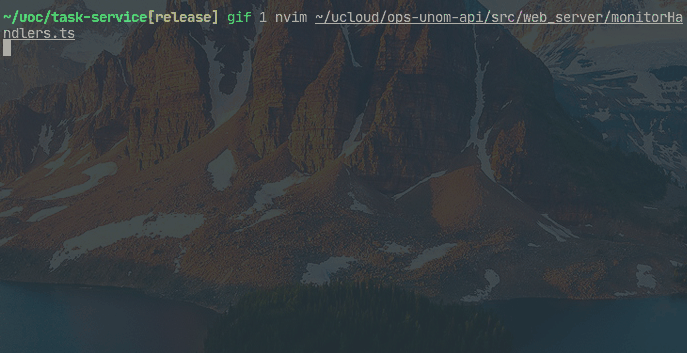

# VIM HL CHUNK

hignlight chunk signcolumn plug of nvim

vim version: [vim-hlchunk](https://github.com/yaocccc/vim-hlchunk)



## OPTIONS

```options
  ENGLISH
    " what files are supported, default '*.ts,*.js,*.json,*.go,*.c'
      let g:hlchunk_files = '*.ts,*.js,*.json,*.go,*.c'
    " hlchunk indentline highlight
      au VimEnter * hi HLIndentLine ctermfg=244
    " delay default 50
      let g:hlchunk_time_delay = 50
    " indentline chars(Anti-Clockwise) default ['─', '─', '╭', '│', '╰', '─', '>']
      let g:hlchunk_chars=['─', '─', '╭', '│', '╰', '─', '>']
    " hlchunk_line_limit default 5000
      let g:hlchunk_line_limit = 5000
    " hlchunk_col_limit default 500
      let g:hlchunk_col_limit = 500
    " hi style default 'ctermfg=244'
      let g:hlchunk_hi_style = 'ctermfg=244'

  中文
    " 支持哪些文件 默认为 '*.ts,*.js,*.json,*.go,*.c'
      let g:hlchunk_files = '*.ts,*.js,*.json,*.go,*.c'
    " 缩进线的高亮
      au VimEnter * hi HLIndentLine ctermfg=244
    " 延时 默认为50
      let g:hlchunk_time_delay = 50
    " 高亮线符号(逆时针) 默认为 ['─', '─', '╭', '│', '╰', '─', '>']
      let g:hlchunk_chars=['─', '─', '╭', '│', '╰', '─', '>']
    " 最大支持行数 默认3000(超过5000行的文件不使用hlchunk)
      let g:hlchunk_line_limit = 5000
    " 最大支持列数 默认100(超过500列的文件不使用hlchunk)
      let g:hlchunk_col_limit = 500
    " 高亮线的hi样式 默认为 'ctermfg=244'
      let g:hlchunk_hi_style = 'ctermfg=244'
```
